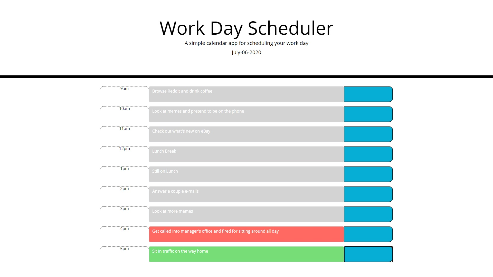

Week 5 Homework
Rutgers Coding Bootcamp
7/6/2020

Nicholas La Monaco

Simple Planner App Using Javascript

A simple planner app to keep track of a workday in time-slots

Uses Moment.js API to display the date and time

Applies color coded selectors to the time slots based on past, present, and future

Saves the user inputs to localStorage and retrieves them on startup

The application is fully functional and I plan to optimize it in the future as my skill improves

